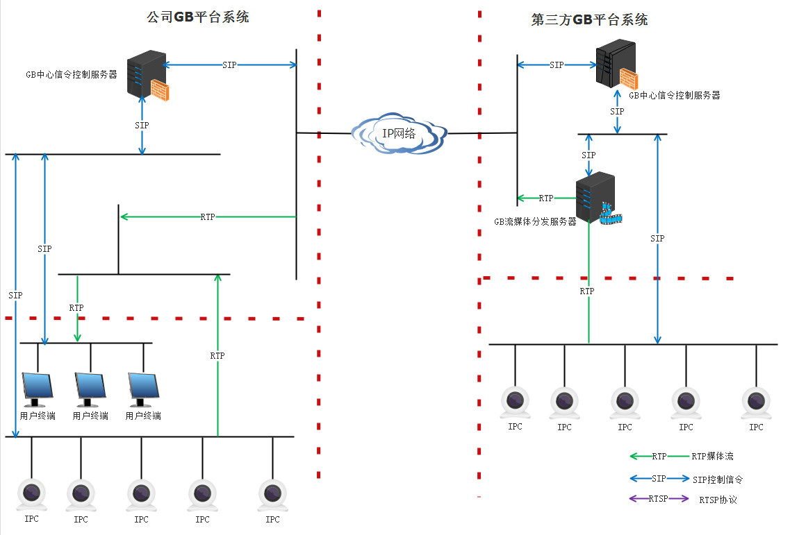
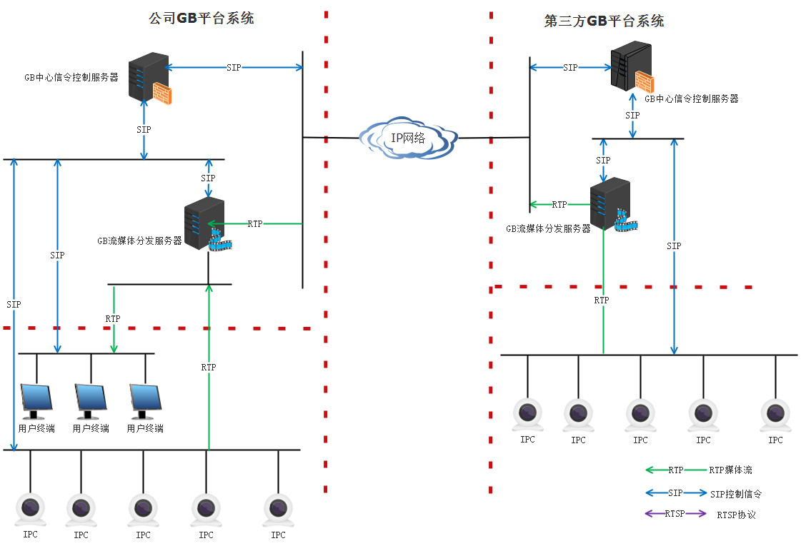

# GB28181的常规问题域

SIP之GB28181注册详解

GB28181注册抓包

SIP协议PPT

SIP注册

SIP注册代码示例

SIP协议

SIP协议简介

首行（start-line）

消息头（message-header）

GB28181资料

对接视频

报警事件通知和分发

GB28181检测

检测工具及模拟设备

GB28181的rport机制

## GB28181常见的网络架构

不带流媒体服务的接入结构

带流媒体服务的接入结构:

## GB28181的系统角色组成(包含有哪些角色)

 1.  中心信令控制服务器 center control server
     向SIP客户端、SIP设备、媒体服务器和网关提供注册、路由选择及逻辑控制功能，并且提供接口与应用服务器通信。组成中心信令的实体包括代理服务器、注册服务器、重定向服务器、B2BUA等一种或几种，是负责核心SIP信令应用处理的SIP服务器。
 2. 媒体分发服务器 
     提供流媒体转发服务，接入来自SIP设备的媒体发送者、网关、或第三方系统的媒体数据。绶解媒体发送设备压力，解决第三方流接入不可控的问题。
 3.  SIP客户端 SIP client
     具有注册登记、建立/终止会话连接、接收和播放媒体流等功能，主要包用户界面、用户代理（UA）、媒体解码模块和媒体通信模块。UA符合RFC3261规定，媒体通信模块支持实现媒体传输和媒体回放控制。
 4.  SIP 设备 媒体发送者（IPC）
     具有注册、建立/终止会话连接和控制、采集/编码及传送媒体流等功能实体，主要包括用户代理（UA）、媒体采集和媒体通信模块。UA符合RFC3261规定，媒体通信模块支持实现媒体传输和媒体回放控制。
 5.  媒体存储检索服务器
      从媒体服务获取指定的媒体流进行存储，存储格式mp4，支持按时间进行历史文件检索。
 6.  回放流化服务器
     负责将从媒体存储检索服务器中的检索出来的媒体文件，进行重新解复用，一对一的转发给对应的客户端播放。
     
 ## 联网结构

## 最初的2011版本协议结构

## 当前最新的2016 版本协议结构

## 执行协议标准
   GB / T 28181 V 2016

## 一个执行的GB28181系统落地计划

如何构建一个GB28181系统/平台/网关，下面是一个可参考的迭代开发计划,可以在敏捷开发中，分为三个大的Componet或者EPIC.

## - 第一阶段：基础构建阶段
    基础构建阶段的目标为：接入第三方国标系统平台的视频流，可点播，可回放，可云台控制（取决第三方平台支持程度），开发服务与软件包括SIP客户端、SIP中心控制服务器，一个软件一个服务器。
    1.  SIP客户端功能 （SDK库）
        1.1 支持GB28181 UAC注册
        1.2 支持GB28181 UAC心跳机制
        1.3 支持GB28181 目录订阅通知
        1.4 支持GB28181 目录查询
        1.5 支持GB28181 历史文件检索
        1.6 支持GB28181 实时媒体流点播
        1.7 支持GB28181 历史流回放
        1.8 支持GB28181媒体流接收（RTP for UDP）
        1.9 支持GB28181 媒体流解码显示
        1.10  支持GB28181 历史流回放控制
        1.11 支持断流监测上报
        1.12 支持媒体流保活机制
        1.13 支持GB28181云台控控制
    2. SIP服务器功能 （可执行程序）
       2.1 支持GB28181 服务器注册、认证（Digest认证方案）
       2.2 支持GB28181 服务器心跳机制
       2.3 支持GB28181 目录订阅通知
       2.4 支持GB28181 历史文件检索
       2.5 支持GB28181 目录查询
       2.6 支持GB28181 实时媒体流点播
       2.7 支持GB28181 历史流回放
       2.8 支持GB28181 历史流回放控制
       2.9 支持GB28181 媒体点播管理
       2.10 支持HTTP配置接口
       2.11 支持HTTP状态、日志查询接口
       2.12 支持Berkeley本地数据进行永久数据存储
       2.13 支持MYSQL数据进行永久数据存储       
       2.14 支持媒体流保活机制
       2.15 支持目录管理机制
       2.16 支持GB28181云台控控制
       
## - 第二阶段：进一步完善阶段
     在进一步完善阶段目标，解决媒体流播放质量，与第三方平台断流、串流等问题，保证媒体流稳定性，提升第三方平台接入媒体流的可控性。增加媒体分发服务器，客户端与媒体服务器增加部分功能。
     1. 客户端增加功能
         1.1 增加支持 RTP for TCP媒体流接收方式
         1.2 增加支持第三方点播功能
     2. SIP中心控制服务器增加功能
         2.1 增加支持媒体分发服务器的管理功能
         2.2 增加支持注册上级功能
         2.3 增加支持下级GB28181心跳机制
     3. 媒体服务器功能
        3.1 支持RTP for UDP/TCP传输
        3.2 支持HTTP配置接口
        3.3 支持HTTP状态查询、日志查询接口
        3.4 支持媒体分发机制
        3.5 支持媒体流异常检测及处理机制
     
## - 第三阶段：系统能力强化阶段
     强化阶段的目标，提升系统功能的增值服务，在系统内进行录像与回放及控制。增加存储检索服务器、回放流化服务器。
     1.  SIP中心控制服务增加功能
        1.1 增加对存储检索服务器管理机制
        1.2 增加对回放流化服务器管理机制
     2. 存储检索服务器功能
        2.1 支持MP4格式文件存储
        2.2 支持GB28181按时间检索文件生成文件目录
        2.3 支持MYSQL数据数据管理功能
        2.4 支持数据索引管理机制
        2.5 支持HTTP配置接口
        2.6 支持HTTP状态查询、日志查询接口
     3.  回放流化功能  
        3.1 支持MP4文件解复用
        3.2 支持RTP for TCP/UDP媒体流传输（一对一的方式）
        3.3 支持GB28181回放控制
        3.4 支持GB28181回放状态通知
        3.5 支持GB28181回放文件下载
        3.6 支持HTTP配置接口
        3.7 支持HTTP状态查询、日志查询接口    

## 环境与性能要求

- 环境与性能依据实际使用场景详细说明

## 验收标准

1. 一轮迭代一轮验收
2.  根据实际使用场景，与对应的第三方平台进行实际对接，满足每一阶段功能点与性能要求。

---

[文章来源](https://github.com/songlei150/gb28181/wiki/VideoSurveillanceNetworkSystemForPublicSecurity) |[图片来源](https://github.com/songlei150/gb28181) | 编辑：[Edwrd](github.com/crazybber)
